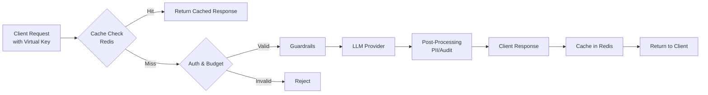

# LLM Gateway Microservice


A production-ready gateway for routing LLM API calls, designed to provide a unified endpoint, reliability, caching, and governance for your AI applications.

## Architecture

The gateway follows a synchronous flow, ensuring strict validation and processing at every step:



## Features

- **Unified Endpoint**: Standardized `POST /v1/chat/completions` interface for all interactions.
- **Rate Limiting**: Precise token-based data consumption limits.
- **Semantic Caching**: Caches responses in Redis based on prompt semantics (via embeddings) to cut costs and latency.
- **Virtual Keys**: Issue virtual keys to clients effectively masking original provider keys while tracking budget/usage.
- **Key Caching**: Optimizes authentication performance by caching key validation results.
- **PII Masking**: Bi-directional masking of sensitive data (credit cards, emails) in both input prompts and output responses.
- **Budget Alerts**: Automated email notifications when budget usage exceeds defined thresholds (e.g., 80%).
- **Fallbacks**: Automatic failover to backup LLM providers if the primary provider fails.
- **Logging**: Comprehensive logging of full request/response pairs for auditing and fine-tuning.

## Tech Stack

| Component | Technology | Description |
|-----------|------------|-------------|
| **Core** | Python (FastAPI) | High-performance async web framework |
| **Database** | PostgreSQL | Store User configs, Virtual Keys, and Logs |
| **Vector DB** | ChromaDB | Request history with metadata filtering (temp, model, provider) |
| **Cache** | Redis | Rate Limiting, Semantic Response Caching |
| **Infra** | Docker | Containerized deployment |

## Getting Started

### Prerequisites

- Docker & Docker Compose installed

### Run Locally

1. **Clone the repository:**
   ```bash
   git clone <repository-url>
   cd llm-gateway
   ```

2. **Configure Environment:**
   Create a `.env` file in the root directory.

3. **Start Services:**
   ```bash
   docker-compose up --build
   ```
   The service will be available at `http://localhost:8000`.

## API Documentation

Interactive documentation is available once the server is running:

- **Swagger UI**: [http://localhost:8000/docs](http://localhost:8000/docs) - Test endpoints directly

